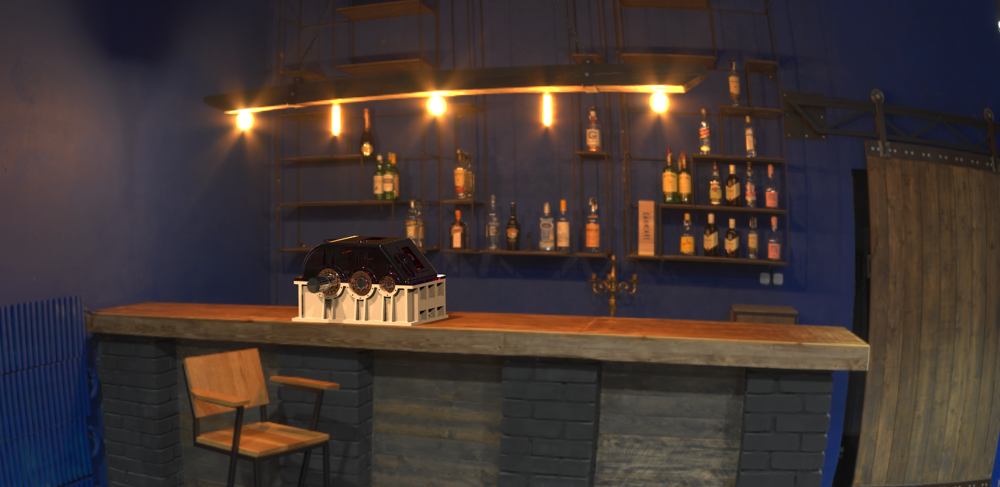

# Инженерный дизайн - CAD (факультатив)

[1 - Плоские модели с зависимостями](https://github.com/CandyGoose/CAD_elective/tree/main/practice1)

[2 - Простые 3D модели](https://github.com/CandyGoose/CAD_elective/tree/main/practice2)

[3 - Модели с полостями](https://github.com/CandyGoose/CAD_elective/tree/main/practice3)

[4 - Валы для редуктора](https://github.com/CandyGoose/CAD_elective/tree/main/practice4)

[5 - Крышка корпуса редуктора](https://github.com/CandyGoose/CAD_elective/tree/main/practice5)

[6 - Сборка](https://github.com/CandyGoose/CAD_elective/tree/main/practice6)

[7 - Анимация и рендеринг](https://github.com/CandyGoose/CAD_elective/tree/main/practice7)

[8 - Создание чертежей](https://github.com/CandyGoose/CAD_elective/tree/main/practice8)

<h3 style="text-align:center">Результат</h3>

